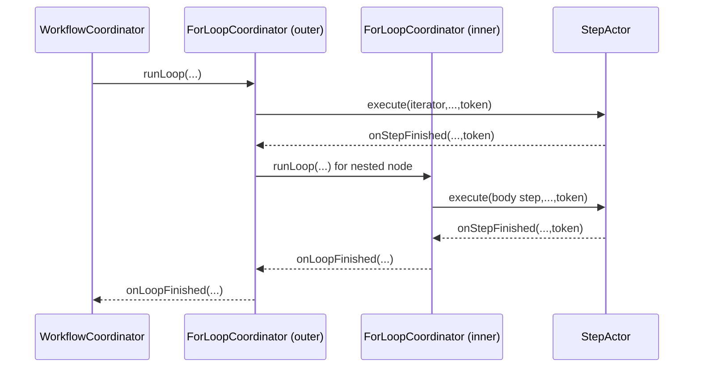

# Rival App Overview (Whole-System Guide)

This is the high-level map of the entire Rival codebase and runtime flow.
Read this first when you want to reorient quickly.

## 1) What Rival Is

Rival is a workflow engine built on Rivet actors.

You write workflows in TypeScript using a fluent builder.
Rival compiles those workflows into actors:

1. Step actors (one per step function)
2. One coordinator actor per workflow

Then `rival(...)` bootstraps a local runtime and exposes a simple API:

1. `run(...)` starts
2. `wait(...)` resolves terminal result

## 2) End-to-End Data Flow

1. **Define** workflow:
- `createWorkflow("name").step(...).build()`

2. **Compile** workflow:
- Builder definition -> plan + actor registry references

3. **Start engine**:
- `rival(workflow)` sets up Rivet registry + runtime

4. **Run** workflow:
- Coordinator actor run action initializes state and schedules continuation

5. **Execute steps**:
- Coordinator starts step actors
- Step actors retry/timeout internally
- Step actors callback coordinator on terminal state

6. **Complete** workflow:
- Coordinator aggregates `stepResults`, sets terminal state
- Waiters resolve via event-first wait with polling fallback

## 3) Project Structure

### Public entry

1. `src/rival/index.ts`
- Barrel exports (public API surface).

### Builder + compiler

1. `src/rival/builder/workflow-builder.ts`
- Fluent DSL (`createWorkflow`, step config, forEach, input schema, etc.).

2. `src/rival/builder/compiler.ts`
- Converts workflow definitions to compiled workflow artifacts:
  - actor definitions
  - plan nodes
  - coordinator actor ref

### Runtime core

1. `src/rival/engine.ts`
- `RivalEngine` implementation.
- `run`, `wait`, `get`, `list`.
- Wait strategy (event-first + polling fallback).

2. `src/rival/core/workflow-coordinator.ts`
- Workflow orchestration state machine.
- Callback handling (`onStepFinished`, `onLoopFinished`, `onParallelFinished`).
- Top-level plan progression + terminal ownership.
- Delegates loop nodes to loop coordinators and concurrent nodes to parallel coordinators.
- Terminal status handling and broadcasts.

3. `src/rival/core/for-loop-coordinator.ts`
- Dedicated loop orchestration actor.
- Handles iterator execution, seq/par iteration progression, nested loop delegation.
- Tracks per-iteration runtime and loop-local cancellation fan-out.

4. `src/rival/core/parallel-coordinator.ts`
- Dedicated concurrent-block orchestration actor.
- Handles fan-out/fan-in for `concurrent(...)` nodes.
- Tracks child statuses and reports aggregate result to parent coordinator.

5. `src/rival/core/step-actor.ts`
- Step execution actor.
- Retry/backoff/timeouts via scheduler.
- Callback to parent coordinator with token guard.

6. `src/rival/core/context-builder.ts`
- Builds the step context object passed to step functions.

### Types

1. `src/rival/types/context.ts`
2. `src/rival/types/step.ts`
3. `src/rival/types/plan.ts`
4. `src/rival/types/workflow.ts`
5. `src/rival/types/errors.ts`
6. `src/rival/types/index.ts`

### Logging

1. `src/rival/logging/logger.ts`
- Step-scoped logging helpers.

### Predefined steps

1. `src/rival/steps/http-step.ts`
2. `src/rival/steps/delay-step.ts`
3. `src/rival/steps/index.ts`

## 4) Runtime Behavior (Current)

### Callback-driven paths

1. Top-level step progression
2. Top-level loop progression via `ForLoopCoordinator`
3. Top-level concurrent progression via `ParallelCoordinator`
4. Nested loop progression via parent loop coordinator -> child loop coordinator
5. Concurrent inside loop via loop coordinator -> parallel coordinator
6. Step retry/timeout completion callbacks

No known blocking nested-loop orchestration path remains in coordinator actors.

### Nested Loop Call Flow (Current)

## 5) Wait Semantics

`wait()` currently does:

1. immediate state check
2. event subscription attempt
3. automatic polling fallback

Options:

1. `timeoutMs` (default `300000`)
2. `pollIntervalMs` (default `250`)
3. `preferEvents` (default `true`)
4. `eventWaitTimeoutMs` (default `3000`)

## 6) Step Execution Semantics

Step actor lifecycle:

1. `execute(...)` kickoff
2. `_attempt(token)` runs one attempt
3. `_onTimeout(token)` applies timeout policy
4. terminal `finalize(...)` + coordinator callback

Guards:

1. execution token
2. timeout token

These prevent stale scheduled actions from mutating active state.

## 7) Where To Read First (By Task)

### I want to understand public API

1. `src/rival/index.ts`
2. `src/rival/engine.ts`
3. `README.md`

### I want to debug orchestration

1. `src/rival/core/workflow-coordinator.ts`
2. `src/rival/core/step-actor.ts`
3. `src/rival/core/context-builder.ts`

### I want to modify builder/compiler behavior

1. `src/rival/builder/workflow-builder.ts`
2. `src/rival/builder/compiler.ts`
3. `src/rival/types/plan.ts`

## 8) Test Map

1. `test/engine.test.ts`
- API surface and wait behavior.

2. `test/foreach-loop.test.ts`
- Loop semantics, failure/continue/retry behavior, nesting cases.

3. `test/step-actors.test.ts`
- Coordinator + step interactions and step behavior matrix.

4. `test/step-actor-scheduling.test.ts`
- Scheduled retry/timeout behavior.

5. `test/builder-compiler.test.ts`
- Builder + compiler integration.

6. `test/predefined-steps.test.ts`
- HTTP/delay predefined steps.

7. `test/timeout-actor-options.test.ts`
- Timeout/action options integration.

8. `test/helpers/wait-for-terminal.ts`
- Shared test utility.

## 9) Current Work Snapshot

Broadly complete:

1. run + wait API model
2. event-first wait with polling fallback
3. callback-driven loop progression (top-level + nested)
4. step actor retry/timeout scheduling core

Known follow-up areas:

1. event wait warning/noise cleanup in local runtime logs
2. ongoing docs polish
