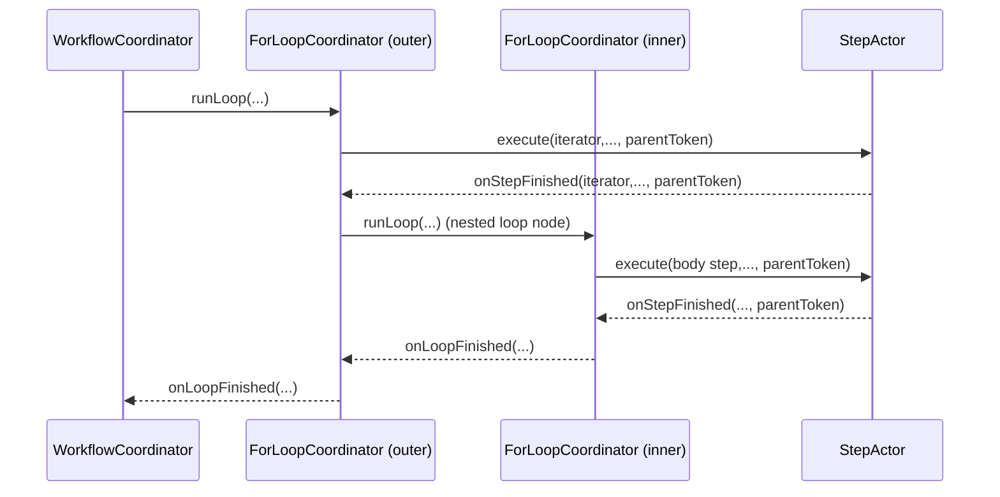

# Rival Runtime: Current State (Developer Guide)

This doc is a practical snapshot of how Rival executes workflows today.
Use it to quickly get back into context while coding.

## 1) Mental Model

Rival runs a workflow with two actor layers:

1. **Coordinator actor** (`workflow-coordinator.ts`)
- Orchestrates the workflow plan.
- Starts top-level step actors.
- Delegates all loop nodes to loop coordinator actors.
- Tracks workflow state/results.
- Handles callbacks from step actors and loop coordinators.

2. **Loop coordinator actors** (`for-loop-coordinator.ts`)
- One actor per loop definition/ref, instantiated per run/key.
- Execute iterator + body progression for both top-level and nested loops.
- Spawn child loop coordinators for nested loop nodes.
- Handle per-loop cancel propagation to active children.

3. **Step actors** (`step-actor.ts`)
- Execute user step functions.
- Own retry/timeout scheduling.
- Persist step-local state.
- Notify parent coordinator when terminal.

Core rule: coordinator should prefer **message/callback progression** over blocking poll loops.

## 2) API Surface (Current)

From `engine.ts`:

1. `engine.run(workflowName, input?, runId?)`
- Starts execution.
- Returns `{ runId, status: "running" }`.

2. `engine.wait(workflowName, runId, options?)`
- Returns terminal workflow result.
- Uses event-first strategy with polling fallback.

3. `engine.get(workflowName).getOrCreate(runId)`
- Gives instance with:
  - `run(runId, input)`
  - `wait(options?)`
  - `cancel()`
  - `getState()`

## 3) Wait Behavior

`wait()` strategy:

1. Check state immediately via `getState()`.
2. Try event subscription path first.
3. If event path is unavailable/times out/errors, fallback to polling.

Relevant options:

1. `timeoutMs` (default `300000`)
2. `pollIntervalMs` (default `250`)
3. `preferEvents` (default `true`)
4. `eventWaitTimeoutMs` (default `3000`)

## 4) What Is Callback-Driven vs Blocking

### Callback-driven now

1. Top-level step progression.
2. Top-level loop progression (iterator/body).
3. Nested loop progression (loop coordinator -> child loop coordinator).
4. Retry/timeout callbacks from step actors.

### Blocking loop orchestration path

1. No known blocking loop orchestration path remains in coordinator actors.
2. Progression is message/callback driven via `schedule.after(0, ...)` and callback actions.

## 5) Nested Loop Sequence (Current)

Notes:
1. Parent/child boundaries are always actor-to-actor actions.
2. Stale callbacks are ignored by token + callback-name guards.
3. Workflow-level terminal state is still owned by `WorkflowCoordinator`.

## 6) Step Retry/Timeout Model

Step actors are async-scheduled:

1. `execute(...)` kickoffs only.
2. `_attempt(token)` handles attempts.
3. `_onTimeout(token)` handles timeout policy.
4. Token guards prevent stale scheduled actions from mutating active runs.

Coordinator callbacks are addressed using persisted `coordinatorRef` + `coordinatorKey`.

## 7) Cancellation Semantics

1. `cancel()` marks workflow cancelled and bumps execution token.
2. Pending stale callbacks/schedules no-op by token/key guards.
3. Active step/loop cancel is best-effort.
4. Loop coordinator cancel propagates to active step actors and child loop coordinators.

## 8) Logging/Names You’ll See

Loop body callback step names are encoded like:

`<loopName>:iter<idx>:node<nodeIdx>:<stepName>`

This is intentional for callback correlation and debugging.

Loop callback names are encoded like:

`<loopName>:iter<idx>:node<nodeIdx>:<childLoopName>:loop:<token>`

## 9) Where To Read Code First

1. `src/rival/engine.ts`
- Public API and `wait()` strategy.

2. `src/rival/core/workflow-coordinator.ts`
- Top-level orchestration + terminal ownership.

3. `src/rival/core/for-loop-coordinator.ts`
- Loop orchestration state machine, nested delegation, loop cancel propagation.

4. `src/rival/core/step-actor.ts`
- Retry/timeout mechanics and coordinator notification.

5. `test/foreach-loop.test.ts`
- Most complete behavior coverage for loop semantics.

6. `test/engine.test.ts`
- API-level behavior including wait options.

## 10) Current Known Sharp Edge

Event wait can log subscription-related warnings in some local test/runtime paths while still functioning via fallback.
Behavior is correct; cleanup of warning/noise is a polish task.
